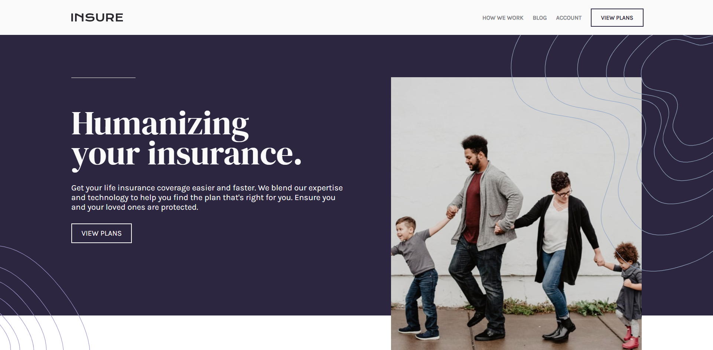

# Frontend Mentor - Insure landing page solution

This is a solution to the [Insure landing page challenge on Frontend Mentor](https://www.frontendmentor.io/challenges/insure-landing-page-uTU68JV8). Frontend Mentor challenges help you improve your coding skills by building realistic projects.

## Table of contents

- [Overview](#overview)
  - [The challenge](#the-challenge)
  - [Screenshot](#screenshot)
  - [Links](#links)
- [My process](#my-process)
  - [Built with](#built-with)
  - [Continued development](#continued-development)
- [Author](#author)

## Overview

### The challenge

Users should be able to:

- View the optimal layout for the site depending on their device's screen size
- See hover states for all interactive elements on the page

### Screenshot

### Links

- Solution URL: [Frontend Mentor](https://www.frontendmentor.io/solutions/semantic-html-css-flexbox-javascript-SAp_cNYtX)
- Live Site URL: [GitHub Pages](https://mikeattah.github.io/insure-landing-page/)

## My process

### Built with

- Semantic HTML5 markup
- CSS custom properties
- CSS Flexbox
- CSS Variables
- JavaScript

### Continued development

I will continue to learn how to create responsive nav bars using CSS and JavaScript.

### Useful resources

- [W3Schools](https://www.w3schools.com/howto/tryit.asp?filename=tryhow_js_responsive_navbar_dropdown) - This helped me with responsive nav bar.

## Author

- Website - [Mike Attah](https://www.mikeattah.com)
- Frontend Mentor - [@mikeattah](https://www.frontendmentor.io/profile/mikeattah)
- Twitter - [@miikeattah](https://www.twitter.com/miikeattah)
